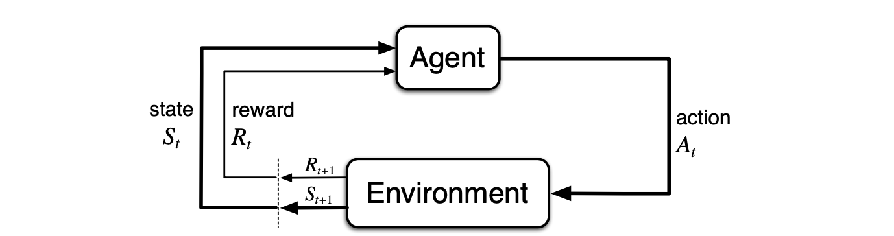

Currently I am working through the book [Reinforcement Learning: An Introduction by Richard S. Sutton and Andrew G. Barto](http://incompleteideas.net/book/RLbook2020.pdf). To engage with the material more thoroughly  I  decided to summarise the content in a series of blog posts. The book is available [here](http://incompleteideas.net/book/RLbook2020.pdf) free of cost (A huge Thank You to Mr. Sutton and Barto for this). I am reading the 2018 version of the book. This post is about chapter 3. 

## What problems do we want to Solve?

Reinforcement Learning is about solving the task of optimal control. More specifically it is a set of solution methods for problems that are formulated as Markov Decision Processes (MDPs).

### (Finite) Markov Decision Process

MDPs are based on the Idea of an agent that performs actions in an environment. The actions can influence the environment, but the environment can also change on its own over time. E.g. imagine a helicopter that learns to fly by controlling the velocity of it's rotors. The actions influence the position of the helicopter, but the environment changes on it's own as well (e.g. wind, temperature, etc.) A nice graphical representation is given in the book.

<figure>
  
  <figcaption>Agent–Environment interaction in a Markov decision process. (Fig. 3.1 in book)</figcaption>
</figure>

An MDP is formally defined as a tuple $(\mathcal{S}, \mathcal{A}, p, \mathcal{R})$, where 

- $\mathcal{S}$ is the set of possible states (representations of the environment)
- $\mathcal{A}$ is the set of actions the agent can perform in each state. If the set of possible actions changes based on the set, we write $A(s)$ for $s \in \mathcal{S}$
- $\mathcal{R}$ is the set of rewards that occurs as in part as a consequence of the actions, in part as a consequence ... if 
- $p: S \times R \times S \times A -> [0, 1]$, $p(s', r | s, a) = Pr(S_t=s', R_t=r | S_{t-1}=s, A_{t-1}=a)$ is the probability of state $s' \in S$ and reward $r \in R$ and occurring in time step $t$.

Additionally the probabilities $p$ should completely describe the dynamics of the environment. That means the probability of a successor state $S_{t+1}$ should not change whether we have know all previous states $S_t, S_{t-1}, S_{t-2}, ...$ or only the state $S_t$. This property is called **Markov Property**.

##### *Finite* MDPs

The book covers only **finite** MDPs in chapter 3. Finite means that the the **state, reward and action sets are finite**. There seems to be two reasons for this additional restriction. 

1. For finite MDPs multiple important theoretical results can be stated which will come in handy later on (e.g. the existance of a unique solution of the Bellmann optimality equation). 
2. The first algorithms that the book introduces, such as *Dynamic Programming* and *Monte Carlo* require to compute and store $|\mathcal{S}|*|\mathcal{A}|$ values, which is only possible if the respective sets are finite.

### *Optimal* navigation of the environment

The goal of the agent is to choose actions in an optimal way. What does optimality means in this context? A obvious wish is to maximise the sum of all rewards the agent encounters during the state-action-reward cycle. To define this formally we first have to define the terms **policy** and **return of an episode**. 

A **policy** defines which action we are going to take if we encounter a state $s \in S$. The policy can also be probabilistic, that is instead of saying *take action $a$ in state $s$*, the policy states *take action $a$ 40% of the time and action $b$ 60% of the time for state $s$* to give. Formally a policy is defined as the Function

$$
\pi: \mathcal{A} \times \mathcal{S} \rightarrow [0, 1]
$$

$$
\pi(a | s ) = Pr(A_t=a | S_t=s)
$$

An **episode** is a sequence of state, action, reward transitions that ends at the terminal time step $T$, that is
$$
S_0, A_0, R_0, S_1, A_2, R_2,...,S_T
$$
 The **return of an episode** is the sum of all encountered rewards starting in timestamp $t$, that is
$$
G_t := R_{t+1} + R_{t+2} + ... + R_T
$$
Having defined the terms *episode* and *return* we can now formulate the goal function. We are searching for a policy $\pi$ that maximises the expected return. Formally the goal function is defined as
$$
v_\pi(s) := \mathbb{E}_\pi (G_t | S_t = s)
$$
This function is also called **state-value function**, as it assignes the *expected return* value to each state. Subsequently our goal is to find a $\pi^*$ that suffices 
$$
v_* := v_{\pi^*} = max_\pi v_\pi(s)
$$

##### Episodic vs Continuing tasks.

The definition of $G_t$ is restricted to episodic tasks, as for continiuing (tasks with no terminal State $S_T$) tasks the value $G_t$ may be infinite. One possible solution presented in the book is to discount future rewards in a way, that prevents divergence. The most common discount strategy is (eq. 3.8 from book)
$$
G_t := \sum_{k=0}^{\infty} \gamma^k R_{t+k+1}
$$
This sum is bounded by 
$$
\sum_{k=0}^{\infty} \gamma^k R_{t+k+1} \leq [max_{t \in \mathbb{N}} R_t] [\sum_k \gamma^k] = \dfrac{1}{1-\gamma} max_{t \in \mathbb{N}} R_t < \infty
$$
 (see geometric series).

### Bellmann (optimality) equation

One of the most important results (as most algorithms presented in the book are based on it in some way) is the idea that the *state-value-function* can be expressed recursively in terms of itself. (eq 3.14 from book)
$$
v_\pi(s) = \sum_a \pi(a|s) \sum_{s', r} p(s', r |s, a) [r+\gamma v_{\pi(s')} ]
$$
This set of equations is called **Bellmann equation**. A similar set of equations can be derived for $v_*$ with (eq. 3.19 from book)
$$
v_*(s) = max_{\pi} \sum_{s', r} p(s', r |s, a) [r+\gamma v_{\pi(s')} ]
$$
This set of equations is called **Bellmann optimality equation**.

##### Backup diagram

For me it was helpful to think in backup diagrams to understand equations 3.14 and 3.19. I won't explain the reasoning behind these diagrams here, but feel free to consult the book for more information.

<figure>
  
  <figcaption>BackUp diagram p.59</figcaption>
</figure>

<figure>
  
  <figcaption>BackUp diagram Fig. 3.4</figcaption>
</figure>

### How to compute $v_\pi$ and $v_*$?

The question how to compute $v_\pi$ and $v_*$ will be the topic of the rest of the book, especially in the case when the dynamics of the environment $p(s', r |s, a)$ are not known. But for now we can give two ways to solve eq. 3.14 and 3.19. Note that if one views $v_\pi(s)$ (or $v_*(s)$) as unknowns, then we there are $|S|$ equations with $|S|$ unknowns in 3.14 and 3.19 (note that we consider only *finite* MDPs here). Additionally 3.14 is a set of linear equations. Therefore a solution exists and can easily be computed by well known algorithm from *Linear Algebra*. 

For 3.19 the authors state that a unique solution exists for finite MDPs and can be found by solving the set of non-linear equations by applying one of the well-known methods to solve non-linear equations. 

The authors also state that these solution methods are not practical in most cases, as one has to know the dynamics of the environment (which is oftentimes unknown or too hard to model) and the runtime of the algorithms to solve the equation systems is too high.

### References

[Reinforcement Learning: An Introduction by Richard S. Sutton and Andrew G. Barto](http://incompleteideas.net/book/RLbook2020.pdf)

