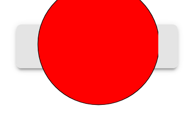

Recently I stumbled into an a problem I didn't really expect. I needed to embed an SVG into Vuetify's `v-btn` as. This **has** to be a simple task, right?

Our example SVG will be this circle.

  

<svg height="200">    
  <circle cx="100" cy="100" r="99" stroke="black" stroke-width="1" fill="red" />  
</svg> 

  </img>

And the result should look like this.


### Naive approach

My first approach was the way I imagined it should work. 

```html
<!-- Doesn't work -->
<v-btn>
  
    <svg viewBox="0 0 200 200">
      <circle
              cx="100"
              cy="100"
              r="99"
              stroke="black"
              stroke-width="1"
              fill="red"
              />
    </svg>
  </img>
</v-btn>
```

The result looks as follows

. 


The natural reflex is to manupulate the **height and width parameters**, but this doesn't work as imagined and produces similar results.

### Slightly less naive approach

[The vuetify documentation tells you](https://vuetifyjs.com/en/components/buttons/) that the svg has to be embedded in a v-icon **link hinzufügen**. So I changed listing 1 to 

```html
<!-- Doesn't work -->
<v-btn>
  <v-icon>
    <svg viewBox="0 0 200 200">
      <circle
              cx="100"
              cy="100"
              r="99"
              stroke="black"
              stroke-width="1"
              fill="red"
              />
    </svg>
  </v-icon>
</v-btn>
```

But this produces just an empty button like this.


No icon at all! Seemed I had to dig deeper for this *simple* task.


### *This is the way* approach

Turned out there were multiple problems at play at the same time. 

**First** I screwed up the creation of `v-icon`. [The whole soluton is described here by @BeHappy](https://stackoverflow.com/questions/64934008/cant-display-svg-in-v-icon) . But summarised one has to do the following.

1. Create a template with the svg data
2. Register the template as Icon in the vuetify configuration
3. Use reference to the registered template in`v-icon`

 

**Second** one has to scale the SVG. Turns out SVG scaling works totally different than normal `img`scaling. One hast to use the `viewBox` attribute.  [A great interactive tutorial that describes the logic behind the viewBox attribute can be found here](https://wattenberger.com/guide/scaling-svg). 

Plugging it all together we get: 

1. **Creating a template for our SVG**

*src/components/MySvgIcon.vue* 

```html
<template>
  <v-img>
    <svg viewBox="0 0 200 200">
      <circle
        cx="100"
        cy="100"
        r="99"
        stroke="black"
        stroke-width="1"
        fill="red"
      />
    </svg>
  </v-img>
</template>
```

Pay attention to the **height** and **width** (3rd and 4th) values of the of the `viewBox`atteibute. These have to be larger or equal to the internal height and width of the SVG to make the whole SVG visible. As described in the link above, these parameters have nothing to do with the size of the rendered image.


2. **Register the template as Icon in the vuetify configuration**

*src/plugins/vuetify.json* 

```html
import Vue from "vue";
import Vuetify from "vuetify/lib";
import MySvgIcon from "@/components/MySvgIcon";

Vue.use(Vuetify);

export default new Vuetify({
  icons: {
    iconfont: "mdi", // default - only for display purposes
    values: {
      mySvgIcon: { component: MySvgIcon }
    }
  }
});

```


3. **Use reference to the registered template in`v-icon`**

*App.vue*

```html
<template>
  <v-app>
    <v-main>
      <v-btn class="ma-5">
        <v-icon>
          $mySvgIcon
        </v-icon>
      </v-btn>
    </v-main>
  </v-app>
</template>

<script>

export default {
  name: "App",

  data: () => ({
    //
  })
};
</script>
```

The whole example can be found [here on Github](https://github.com/borttrob/embed-svg-in-v-icon.git). Hope this helps someone to spare some time with this Problems. Cheers.


### References 

Full example Github: https://github.com/borttrob/embed-svg-in-v-icon.git

Great interactive tutorial for `viewBox` attribute https://wattenberger.com/guide/scaling-svg

Usage of `v-icon`in `v-btn` https://stackoverflow.com/questions/64934008/cant-display-svg-in-v-icon

